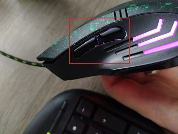

This little tool blocks those side buttons:

It can be used for all those that bought one of those cheap mices that don't come with a configuration tool by the manifacturer and want to get rid of those side buttons.

# Motivation
Read more about my doings here: [How I got rid of those useless mouse buttons using Windows Hooks](https://dev.to/gabbersepp/win32-hooks-spy-how-i-got-rid-of-those-useless-mouse-buttons-using-windows-hooks-16el)

# Download
Go to the release page. Please note that you have to use the 32Bit version if you want to block the buttons in all 32bit processes and the 64 bit version to block them in all 64 bit processes.